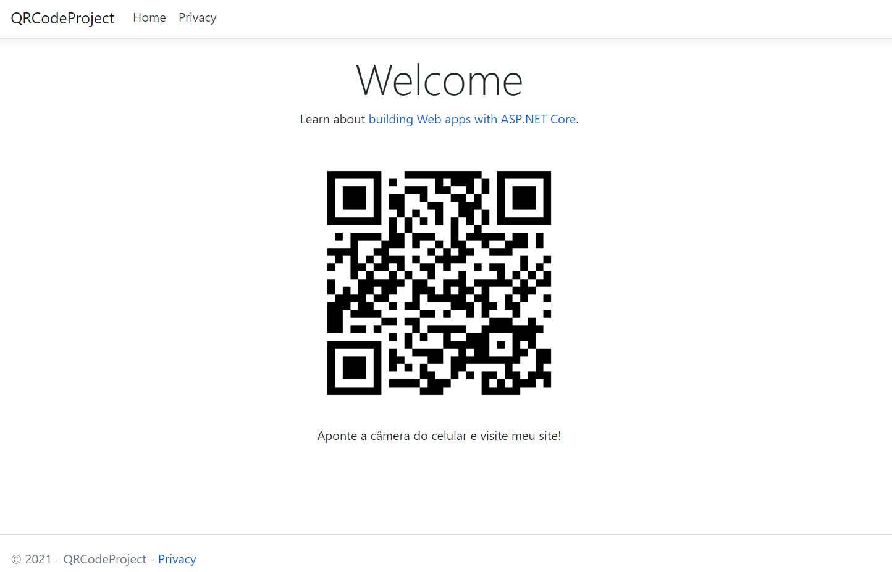

<h1 align="center">Projeto QRCode - ASP.NET Core WepApp</h1>

<p align="center">Projeto feito em ASP.NET Core WebApp para criação de QRCode numa página Web direcionando a um site conforme a URL apontada.</p>

---

### :dart: Objetivo

Tenho como objetivo propor uma forma fácil e simples de gerar QRCode numa página Web com ASP.NET Core, usando C#.

### Clone

Clone este repositório em sua máquina local usando:

```
git clone https://github.com/YuriSiman/qrcode-aspnetcore-webapp.git
```

---

## :rocket: Imagem da Página




---

## :thinking: Contribuindo

> Para começar...

### Passo 1

* :fork_and_knife: Fork este repositório!

### Passo 2

* :dancers: Clone este repositório para sua máquina local usando `https://github.com/YuriSiman/qrcode-aspnetcore-webapp.git`

### Passo 3

* :trident: Crie sua feature branch usando `git checkout -b minha-feature`

### Passo 4

* :white_check_mark: Commit suas mudanças usando `git commit -m "feat: Minha nova feature"`

### Passo 5

* :pushpin: Dê um push usando `git push origin minha-feature`

### Passo 6

* :arrows_clockwise: Crie um novo pull request

Depois que seu pull request for mesclado, você pode excluir sua feature branch  

> Caso tenha dúvidas, confira este guia de como [contribuir no GitHub](https://github.com/firstcontributions/first-contributions)  

---

## :speech_balloon: Suporte

> Entre em contato comigo...  

* Me chame pelo [Linkedin](https://www.linkedin.com/in/yurisiman/)  
* Me mande um e-mail [contato@yurisiman.com.br](mailto:contato@yurisiman.com.br)  

[](https://github.com/YuriSiman)  
[](https://yurisiman.com.br)  

---

## :pencil: Licença

[](https://github.com/YuriSiman/qrcode-aspnetcore-webapp/blob/master/LICENSE)   

---

Code your life...

